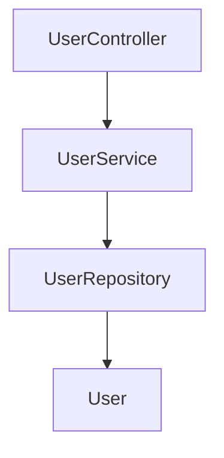

# Java Code to System Design Analyzer Skill

A comprehensive skill for reverse-engineering Java source code into system design documentation.

## What This Skill Does

Analyzes Java codebases and generates:
- **Architecture Diagrams** (Mermaid format)
- **System Flow Documentation** (Markdown)
- **API/Interface Mapping** (Structured JSON)
- **Database Schema & ER Diagrams** (Markdown + Diagrams)
- **Interactive HTML Visualizations**

## Directory Structure

```
java-system-analyzer/
├── SKILL.md                          # Main skill documentation
├── README.md                          # This file
├── references/
│   ├── analysis-patterns.md           # Java analysis patterns guide
│   └── output-templates.md            # Output format examples
├── scripts/
│   └── analyze.py                     # Sample analysis script
└── test-samples/
    ├── UserController.java            # Sample controller
    ├── UserService.java               # Sample service
    └── User.java                      # Sample entity
```

## Key Features

### 1. Component Classification
Automatically categorizes Java classes as:
- **Controllers** - REST endpoints and entry points
- **Services** - Business logic and orchestration
- **Repositories** - Data access layer
- **Entities** - Domain models and JPA entities
- **Utilities** - Cross-cutting concerns

### 2. Relationship Detection
Identifies and maps:
- Dependency injection relationships
- JPA entity relationships (OneToMany, ManyToOne, etc.)
- Service-to-service calls
- External integrations

### 3. API Documentation
Extracts from REST annotations:
- Endpoints (GET, POST, PUT, DELETE)
- Path parameters and query strings
- Request/response types
- Error handling

### 4. Database Schema Analysis
Analyzes JPA entities for:
- Entity mappings to tables
- Column definitions and types
- Primary and foreign keys
- Relationships and constraints
- Indexes and unique constraints

### 5. System Flow Mapping
Traces flows through:
- HTTP request entry points
- Service method calls
- Data persistence
- External service calls

## Usage Examples

### Example 1: Analyze Full Spring Boot Application
```
User: "Analyze this Spring Boot e-commerce application and generate architecture documentation"

Skill will:
1. Parse all Java files
2. Identify layers (Controller, Service, Repository, Entity)
3. Extract REST endpoints
4. Map database schema
5. Generate Mermaid diagrams
6. Create comprehensive Markdown documentation
7. Provide JSON structure for integration
8. Create interactive HTML visualization
```

### Example 2: Specific Module Analysis
```
User: "Show me the architecture of just the Order Processing module"

Skill will:
1. Filter to OrderController, OrderService, OrderRepository, Order entities
2. Show dependencies and relationships
3. Generate sequence diagram for order flow
4. Document database schema for orders
5. List all APIs related to orders
```

### Example 3: Database Schema Generation
```
User: "Create an ER diagram from our data layer entities"

Skill will:
1. Find all @Entity classes
2. Extract field mappings
3. Identify relationships
4. Generate ER diagram
5. Document table structures
```

### Example 4: API Documentation
```
User: "Generate API documentation for our REST services"

Skill will:
1. Find all @RestController classes
2. Extract @RequestMapping, @GetMapping, etc.
3. Document endpoints, parameters, responses
4. Show which services handle each request
5. Generate Swagger-like documentation
```

## Output Formats

### 1. Mermaid Diagrams


### 2. Markdown Documentation
```markdown
# System Architecture

## Components
- UserController: Handles user REST requests
- UserService: Business logic for user management
- UserRepository: Data access for users
- User: JPA entity representing users in database

## APIs
- GET /api/users: Retrieve all users
- GET /api/users/{id}: Retrieve user by ID
- POST /api/users: Create new user
- ...
```

### 3. JSON Structure
```json
{
  "components": [...],
  "relationships": [...],
  "apis": [...],
  "database": {...}
}
```

### 4. Interactive HTML
- Component explorer tree
- Clickable dependency graphs
- Filterable API browser
- Zoomable database diagrams

## How to Use This Skill

1. **Provide Your Java Code**
   - Upload a folder with Java files
   - Paste specific files
   - Provide GitHub repository link

2. **Specify What You Want**
   - Full system analysis
   - Specific module
   - Just APIs
   - Just database schema

3. **Choose Output Formats**
   - Mermaid diagrams
   - Markdown docs
   - JSON data
   - Interactive HTML
   - All of the above

4. **Review & Refine**
   - Ask for specific flow traces
   - Request alternative views
   - Ask clarifying questions
   - Generate additional diagrams

## Analysis Patterns Reference

The skill recognizes these Java patterns:

### Spring Boot
- @RestController, @Service, @Repository annotations
- Dependency injection patterns
- REST mapping annotations
- Configuration classes

### JPA/Hibernate
- @Entity, @Table annotations
- Column definitions
- Relationships (@OneToMany, @ManyToOne, etc.)
- Cascade and fetch strategies

### Common Patterns
- MVC architecture
- Service layer pattern
- Repository pattern
- Dependency injection

## Sample Test Files

The skill includes sample Java files to test with:
- `UserController.java` - REST controller example
- `UserService.java` - Service layer example
- `User.java` - JPA entity example

Run the analyzer on these to see the output formats.

## Tips for Best Results

1. **Include Complete Code** - Provide all relevant Java files
2. **Include Annotations** - REST, JPA annotations help analysis
3. **Be Specific** - Mention which layers/modules to focus on
4. **Request Specific Formats** - Choose formats that suit your audience
5. **Ask for Clarification** - Request deep-dives into specific areas

## Limitations

- Analysis is code-based, not runtime behavior
- Complex reflection/meta-programming may be partially analyzed
- External library internals not analyzed (only dependency detection)
- SQL queries not analyzed (schema structure only)
- Async flow timing not captured (flow structure shown)

## Supported Languages & Frameworks

### Primary
- Java 8+
- Spring Framework
- Spring Boot
- Spring Data JPA
- Hibernate

### Secondary
- Microservices architectures
- REST APIs
- Multi-module projects
- Event-driven systems

## Getting Started

1. Install the skill
2. Upload or paste your Java code
3. Say: "Analyze this code and generate system design documentation"
4. Choose output formats you need
5. Review generated documentation

## Next Steps

After analysis, you can:
- Generate specific diagrams
- Create migration plans
- Document refactoring opportunities
- Build integration documentation
- Create onboarding materials

---

For more information, see:
- `SKILL.md` - Full skill documentation
- `references/analysis-patterns.md` - Analysis pattern guide
- `references/output-templates.md` - Output format examples
- `scripts/analyze.py` - Sample analysis script
