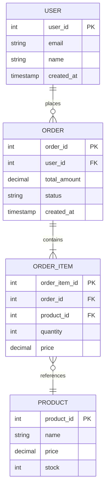
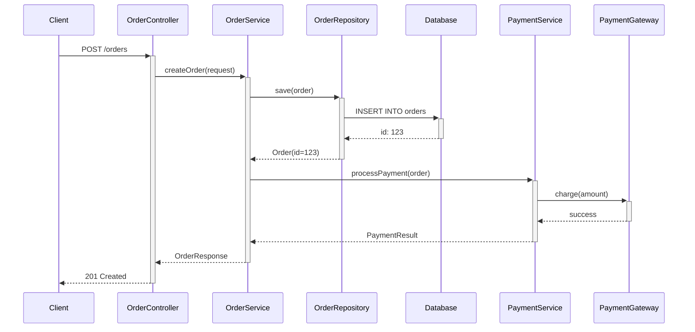
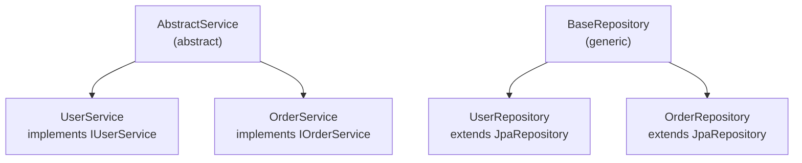

# Output Format Templates

## Format 1: Mermaid Diagrams

### Component Architecture Diagram
```mermaid
graph TB
    subgraph "Presentation Layer"
        UserController[UserController<br/>@RestController]
        OrderController[OrderController<br/>@RestController]
    end
    
    subgraph "Service Layer"
        UserService[UserService<br/>@Service]
        OrderService[OrderService<br/>@Service]
        PaymentService[PaymentService<br/>@Service]
    end
    
    subgraph "Data Access Layer"
        UserRepo[UserRepository<br/>extends JpaRepository]
        OrderRepo[OrderRepository<br/>extends JpaRepository]
    end
    
    subgraph "Domain Model"
        User["User<br/>@Entity"]
        Order["Order<br/>@Entity"]
        OrderItem["OrderItem<br/>@Entity"]
    end
    
    UserController -->|calls| UserService
    OrderController -->|calls| OrderService
    OrderService -->|calls| PaymentService
    UserService -->|uses| UserRepo
    OrderService -->|uses| OrderRepo
    UserRepo -->|accesses| User
    OrderRepo -->|accesses| Order
    Order -->|contains| OrderItem
```

### ER Diagram (Database)


### Sequence Diagram (Request Flow)


### Class Hierarchy Diagram


## Format 2: Markdown Documentation

### Architecture Overview
```markdown
# System Architecture

## Overview
This is a Spring Boot microservice for order management with the following layers:

## Layers

### 1. Presentation Layer
- **Components**: UserController, OrderController
- **Responsibility**: Handle HTTP requests/responses
- **Technology**: Spring REST

### 2. Service Layer
- **Components**: UserService, OrderService, PaymentService
- **Responsibility**: Business logic and orchestration
- **Technology**: Spring Service annotation

### 3. Data Access Layer
- **Components**: UserRepository, OrderRepository
- **Responsibility**: Database access and queries
- **Technology**: Spring Data JPA

### 4. Domain Model
- **Components**: User, Order, OrderItem, Product
- **Responsibility**: Domain entities and relationships
- **Technology**: JPA Entities

## Key Flows

### Order Creation Flow
1. User submits order via API (OrderController)
2. OrderService validates and creates order (OrderService)
3. Payment is processed (PaymentService)
4. Order is persisted to database (OrderRepository)
5. Confirmation sent to user

### User Authentication Flow
1. User submits credentials (UserController)
2. Authentication service validates (UserService)
3. JWT token generated
4. Token returned to client
```

### API Documentation
```markdown
## APIs

### User Management

#### GET /api/users/{id}
- **Description**: Retrieve user by ID
- **Parameters**: 
  - id (path, required): User ID
- **Response**: User object
- **Status**: 200 OK
- **Called by**: UserController.getUser()

#### POST /api/users
- **Description**: Create new user
- **Request Body**: 
  ```json
  {
    "email": "user@example.com",
    "name": "John Doe"
  }
  ```
- **Response**: Created user object with ID
- **Status**: 201 Created

### Order Management

#### POST /api/orders
- **Description**: Create new order
- **Request Body**: OrderRequest
- **Response**: OrderResponse
- **Services Called**: OrderService, PaymentService
- **Database**: INSERT Order, OrderItem
```

### Database Documentation
```markdown
## Database Schema

### User Table
| Column | Type | Constraints |
|--------|------|-------------|
| user_id | INT | PRIMARY KEY, AUTO_INCREMENT |
| email | VARCHAR(255) | UNIQUE, NOT NULL |
| name | VARCHAR(255) | NOT NULL |
| created_at | TIMESTAMP | DEFAULT CURRENT_TIMESTAMP |

### Order Table
| Column | Type | Constraints |
|--------|------|-------------|
| order_id | INT | PRIMARY KEY, AUTO_INCREMENT |
| user_id | INT | FOREIGN KEY → User.user_id |
| total_amount | DECIMAL(10,2) | NOT NULL |
| status | VARCHAR(50) | DEFAULT 'PENDING' |
| created_at | TIMESTAMP | DEFAULT CURRENT_TIMESTAMP |

### Relationships
- User → Order: ONE TO MANY
- Order → OrderItem: ONE TO MANY
- OrderItem → Product: MANY TO ONE
```

## Format 3: JSON Structure

```json
{
  "system": {
    "name": "Order Management System",
    "language": "Java",
    "framework": "Spring Boot",
    "version": "3.0"
  },
  "components": [
    {
      "id": "user-controller",
      "name": "UserController",
      "type": "Controller",
      "package": "com.example.controller",
      "annotations": ["@RestController", "@RequestMapping(\"/api/users\")"],
      "methods": [
        {
          "name": "getUser",
          "mapping": "GET /{id}",
          "parameters": ["id"],
          "returns": "User"
        }
      ]
    },
    {
      "id": "user-service",
      "name": "UserService",
      "type": "Service",
      "package": "com.example.service",
      "annotations": ["@Service"],
      "dependencies": ["UserRepository"]
    }
  ],
  "relationships": [
    {
      "from": "user-controller",
      "to": "user-service",
      "type": "dependency",
      "method": "constructor_injection"
    }
  ],
  "database": {
    "tables": [
      {
        "name": "user",
        "entity": "User",
        "columns": [
          {"name": "user_id", "type": "INT", "primaryKey": true},
          {"name": "email", "type": "VARCHAR", "unique": true}
        ]
      }
    ],
    "relationships": [
      {
        "from": "order",
        "to": "user",
        "type": "many_to_one",
        "foreignKey": "user_id"
      }
    ]
  },
  "apis": [
    {
      "method": "GET",
      "path": "/api/users/{id}",
      "controller": "UserController",
      "parameters": [{"name": "id", "type": "Integer"}],
      "returns": {"type": "User"}
    }
  ],
  "flows": [
    {
      "name": "Order Creation",
      "steps": [
        "OrderController.createOrder()",
        "OrderService.create()",
        "PaymentService.process()",
        "OrderRepository.save()"
      ]
    }
  ]
}
```

## Format 4: Interactive HTML Visualization

### Component Explorer
- Tree view of all components
- Click to expand/collapse layers
- Show dependencies on hover
- Filter by type (Controller, Service, Repository, Entity)
- Search functionality

### Dependency Graph
- Interactive force-directed graph
- Drag nodes to rearrange
- Click to highlight all connections
- Node color by layer
- Edge thickness by dependency count

### API Browser
- Searchable list of all endpoints
- Expandable endpoint details
- Parameter/response schemas
- Try-it-out functionality
- cURL command generation

### Database Explorer
- Table browser
- Column details with types
- Relationship visualization
- Foreign key highlighting
- Index information
