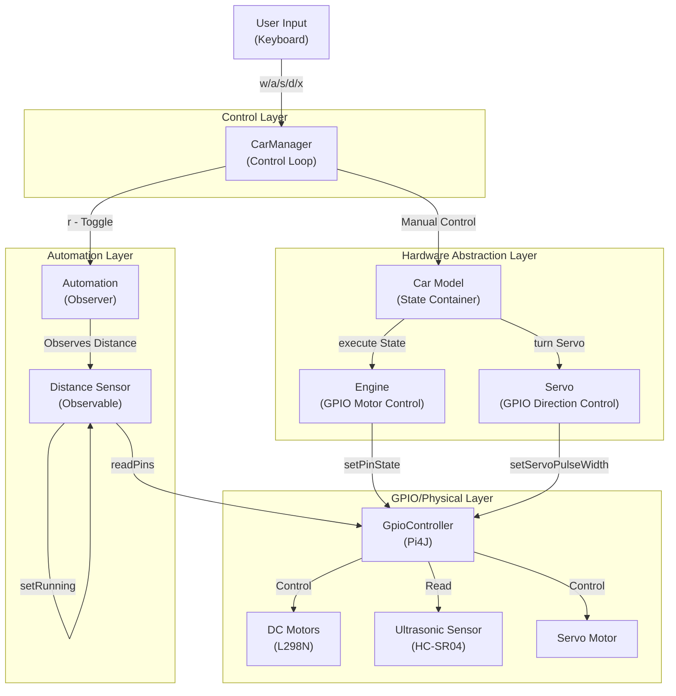
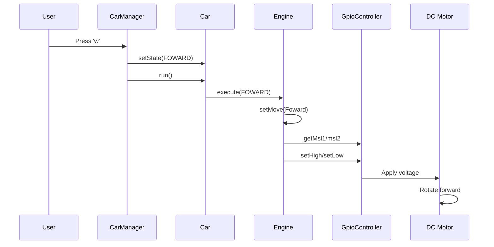
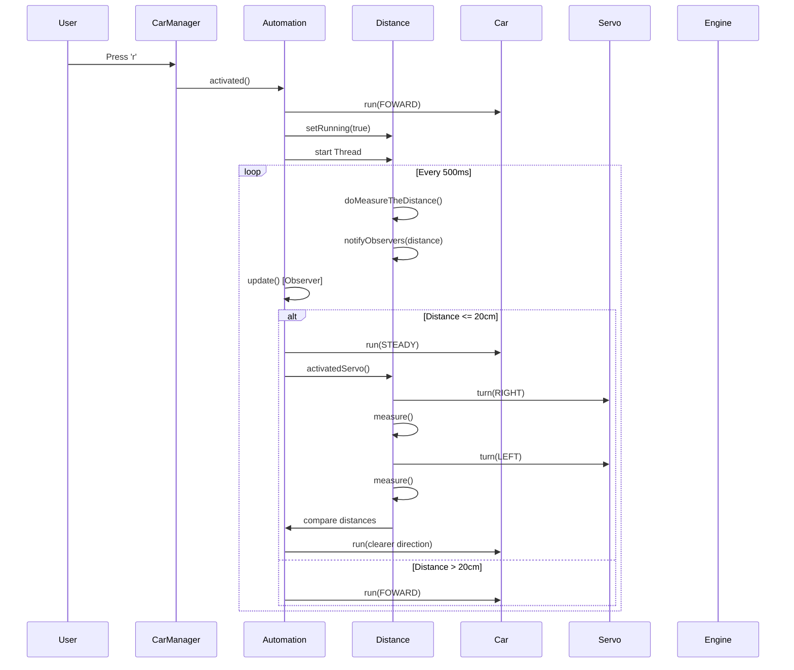
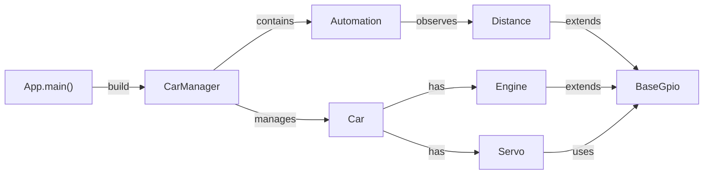
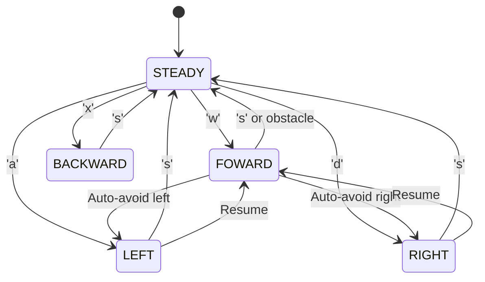

# Pi-Car System Architecture & Design Documentation

## 1. System Overview

The **pi-car** is a Raspberry Pi 3B+ based autonomous vehicle that supports two control modes:
- **Manual Mode**: Keyboard-driven control via `w/a/s/d/x` input
- **Autonomous Mode**: Self-driving with obstacle detection and avoidance

---

## 2. Architecture Diagrams

### 2.1 Component Architecture



### 2.2 Manual Control Flow



### 2.3 Autonomous Driving Flow



### 2.4 System Dependency Graph



### 2.5 State Machine



---

## 3. Component Descriptions

### 3.1 Control Layer

#### `CarManager` (Main Control Loop)
**Responsibility**: User input handling and mode switching
- **Location**: `com.kopiitem.pi.car.manager.CarManager`
- **Responsibilities**:
  - Read keyboard input in infinite loop
  - Parse input characters (w/a/s/d/x/r/t/u/y/z)
  - Update car state based on input
  - Toggle between manual and autonomous modes
  - Graceful shutdown
- **Key Methods**:
  - `run()` - Main event loop
  - `build(Car, ...)` - Builder pattern initialization
  - `shutdown()` - Cleanup and exit
- **Dependencies**: `Automation`, `Car`, `Servo`

### 3.2 Automation Layer

#### `Automation` (Autonomous Driving Logic)
**Responsibility**: Self-driving logic based on sensor input
- **Location**: `com.kopiitem.pi.car.manager.Automation`
- **Pattern**: Observer Pattern (listens to Distance sensor)
- **Responsibilities**:
  - Monitor distance sensor in real-time
  - Trigger obstacle avoidance when distance ≤ 20cm
  - Coordinate servo sweep to find clearer path
  - Resume forward motion after avoidance
- **Key Methods**:
  - `activated()` - Start autonomous mode
  - `deActivated()` - Stop autonomous mode
  - `update(Observable, Object)` - Observer callback
- **Dependencies**: `Distance`, `Car`, `Constants`

#### `Distance` (Ultrasonic Sensor)
**Responsibility**: Read HC-SR04 sensor and notify observers
- **Location**: `com.kopiitem.pi.car.io.Distance`
- **Pattern**: Observable (notifies Automation of distance changes)
- **GPIO Pins**: 
  - Trigger: GPIO_28 (output)
  - Echo: GPIO_29 (input)
- **Key Methods**:
  - `run()` - Background thread loop
  - `doMeasureTheDistance()` - Trigger and read sensor
  - `activatedServo()` - Sweep servo to find path
  - `notifyObservers(value)` - Send distance to listeners
- **Thread**: Runs continuously in background

### 3.3 Hardware Abstraction Layer

#### `Car` (Model & State Container)
**Responsibility**: Represents car state and coordinates hardware
- **Location**: `com.kopiitem.pi.car.model.Car`
- **State Enum**: `FOWARD, BACKWARD, LEFT, RIGHT, STEADY`
- **Responsibilities**:
  - Hold current movement state
  - Initialize Engine and Servo
  - Coordinate execution of movements
- **Key Methods**:
  - `run()` - Execute current state
  - `run(State)` - Execute specific state
  - `setState(State)` - Update state
- **Composition**: Contains `Engine` and `Servo`

#### `Engine` (Motor Control)
**Responsibility**: GPIO control for DC motors
- **Location**: `com.kopiitem.pi.car.io.Engine`
- **GPIO Pins**: GPIO_22, GPIO_23, GPIO_24, GPIO_25
- **Pattern**: Command Pattern (executes Move implementations)
- **Supported Movements**: 
  - `Foward` - Both motors forward
  - `Back` - Both motors backward
  - `Left` - Right motor faster
  - `Right` - Left motor faster
  - `Steady` - Both motors off
- **Key Methods**:
  - `execute(State)` - Create and execute Move command
  - `setMove(Move)` - Set movement strategy
- **Dependencies**: All `Move` implementations

#### `Servo` (Direction Control)
**Responsibility**: GPIO control for servo motor
- **Location**: `com.kopiitem.pi.car.io.Servo`
- **Pulse Widths**: LEFT(200), MIDDLE(150), RIGHT(100)
- **States**: 
  - `LEFT` - Sensor points left
  - `MIDDLE` - Sensor points forward
  - `RIGHT` - Sensor points right
- **Key Methods**:
  - `turn(ServoState)` - Smooth rotation to angle
  - Incremental pulse width adjustment with 10ms delays

#### `BaseGpio` (Abstract Base)
**Responsibility**: Shared GPIO controller access
- **Location**: `com.kopiitem.pi.car.io.BaseGpio`
- **Pattern**: Template Method / Base Class
- **Provides**: 
  - Singleton access to `GpioController`
  - Shutdown method for cleanup

### 3.4 Movement Model Layer

#### `Move` Interface & Implementations
**Responsibility**: Encapsulate movement logic (Command Pattern)
- **Location**: `com.kopiitem.pi.car.model.*`
- **Implementations**:
  - `Foward` - Set msl1, msr1 HIGH
  - `Back` - Set msl2, msr2 HIGH
  - `Left` - Set msl1 HIGH, msr2 HIGH
  - `Right` - Set msr1 HIGH, msl2 HIGH
  - `Steady` - Set all pins LOW
- **Benefit**: Easy to add new movement types without modifying Engine

### 3.5 Utility Layer

#### `Constants` (Configuration)
- **Location**: `com.kopiitem.pi.car.util.Constants`
- **Values**: `RANGE_DETECTION = 20` (cm threshold)

---

## 4. Data Flows

### 4.1 Manual Control Flow (Input → GPIO)

```
User Input (Keyboard)
    ↓
CarManager.run() - Read input
    ↓
Parse character (w/a/s/d/x)
    ↓
Car.setState(State)
    ↓
Car.run()
    ↓
Engine.execute(State)
    ↓
Create Move strategy (Foward, Back, Left, Right, Steady)
    ↓
Move.execute(Engine)
    ↓
Engine.getMsl1/2/msr1/2 - Get GPIO pins
    ↓
GpioPinDigitalOutput.high() / low()
    ↓
GPIO Controller
    ↓
L298N Driver
    ↓
DC Motors rotate
```

### 4.2 Autonomous Mode Flow (Sensor → Decision → Action)

```
Distance Sensor (HC-SR04)
    ↓
Distance.doMeasureTheDistance()
    - GPIO_28: Send 10µs trigger pulse
    - GPIO_29: Measure echo duration
    - Calculate: distance = (time * 17150) / 1e9
    ↓
Distance.notifyObservers(value)
    ↓
Automation.update(Observable, distance_value)
    ↓
if (distance <= 20cm):
    Automation.activatedServo()
        ↓
        Dist.turn(RIGHT) → Measure
        Dist.turn(LEFT) → Measure
        ↓
        if (left_distance > right_distance):
            Car.run(LEFT)
        else:
            Car.run(RIGHT)
        ↓
        Car.run(FOWARD)
else:
    Continue FOWARD
```

### 4.3 Servo Direction Flow

```
Automation or User (turn request)
    ↓
Servo.turn(ServoState)
    ↓
Loop: increment/decrement pulse width
    ↓
ServoDriver.setServoPulseWidth(value)
    ↓
RPIServoBlasterProvider
    ↓
GPIO
    ↓
Servo Motor rotates
    ↓
Ultrasonic sensor head points in new direction
```

---

## 5. API/Control Interface Mapping

### 5.1 User Input API (via Keyboard)

| Key | Action | Effect |
|-----|--------|--------|
| `w` | Forward | `Car.setState(FOWARD)` |
| `x` | Backward | `Car.setState(BACKWARD)` |
| `a` | Turn Left | `Car.setState(LEFT)` |
| `d` | Turn Right | `Car.setState(RIGHT)` |
| `s` | Stop | `Car.setState(STEADY)` |
| `r` | Toggle Auto | `Automation.activated() / deActivated()` |
| `t` | Servo Left | `Servo.turn(LEFT)` |
| `y` | Servo Middle | `Servo.turn(MIDDLE)` |
| `u` | Servo Right | `Servo.turn(RIGHT)` |
| `z` | Exit | `CarManager.shutdown()` |

### 5.2 GPIO Control API

**Engine Controls (Motor Pins)**:
```java
GPIO_22: msl1 (Motor Speed Left 1)
GPIO_23: msl2 (Motor Speed Left 2)
GPIO_24: msr1 (Motor Speed Right 1)
GPIO_25: msr2 (Motor Speed Right 2)
```

**Distance Sensor Pins**:
```java
GPIO_28: Trigger (Output) - Send ultrasonic pulse
GPIO_29: Echo (Input) - Receive echo duration
```

**Servo Control**:
```java
Servo Driver: RPIServoBlaster
Pulse Widths:
  - LEFT (200)
  - MIDDLE (150)
  - RIGHT (100)
```

### 5.3 Method Call Hierarchy

```
App.main()
    ↓
CarManager.build(Car)
    ↓
CarManager.run()  ← Main loop
    ├─→ Scanner.nextLine()
    ├─→ Car.setState(State)
    ├─→ Car.run()
    │   └─→ Engine.execute(State)
    │       └─→ Move.execute(Engine)
    ├─→ Servo.turn(ServoState)
    └─→ Automation.activated()
        └─→ Distance.setRunning(true)
        └─→ new Thread(Distance).start()
```

---

## 6. Listener Pattern Implementation

### Distance ← Automation Relationship

`Distance` no longer extends the deprecated `java.util.Observable`. It exposes a typed `DistanceListener` callback instead:

```java
public interface DistanceListener {
    void onDistanceChanged(int distanceCm);
}
```

```java
Distance dist = new Distance();
dist.addListener(distanceCm -> {
    if (distanceCm <= Constants.RANGE_DETECTION) {
        // Obstacle detected - activate avoidance
        getCar().run(State.STEADY);
        getDistance().activatedServo(getCar());
        getCar().run(State.FOWARD);
    }
});
```

**Notification Flow**:
1. Distance thread runs continuously
2. Reads sensor every 500ms
3. Calls `notifyListeners(value)`
4. Automation's lambda callback invoked with a typed `int` (no casting)
5. Triggers obstacle avoidance logic

---

## 7. Architectural Patterns Used

### 7.1 Command Pattern (Movement)
- **Abstraction**: `Move` interface
- **Implementations**: `Foward`, `Back`, `Left`, `Right`, `Steady`
- **Invoker**: `Engine`
- **Benefit**: Easy to add new movement types

### 7.2 Listener Pattern (Sensors)
- **Subject**: `Distance` (maintains a `List<DistanceListener>`)
- **Listener**: `Automation` registers a lambda via `DistanceListener`
- **Pattern**: Real-time, type-safe sensor notifications (replaces deprecated `Observable`/`Observer`)

### 7.3 Builder Pattern (Initialization)
- **Builder**: `CarManager.build(Car)`
- **Product**: Configured `CarManager`
- **Benefit**: Fluent API for setup

### 7.4 Template Method (GPIO)
- **Abstract Base**: `BaseGpio`
- **Template**: GPIO initialization and shutdown
- **Subclasses**: `Engine`, `Distance`, `Servo`

### 7.5 Singleton (GPIO Controller)
- **Instance**: `GpioFactory.getInstance()`
- **Shared across**: All GPIO classes
- **Benefit**: Single controller for all pins

---

## 8. Package Structure

```
com.kopiitem.pi.car
├── App                          [Entry point]
├── io/                          [Hardware I/O]
│   ├── BaseGpio                 [GPIO base]
│   ├── Engine                   [Motor control]
│   ├── Distance                 [Sensor control]
│   ├── DistanceListener         [Typed sensor callback interface]
│   └── Servo                    [Servo control]
├── model/                       [Domain & Movement]
│   ├── Car                      [State container]
│   ├── State                    [Enum: FOWARD, etc]
│   ├── Move                     [Interface]
│   ├── Foward, Back, Left, etc  [Implementations]
├── manager/                     [Control Logic]
│   ├── CarManager               [Main control loop]
│   └── Automation               [Auto-driving logic]
└── util/                        [Utilities]
    └── Constants                [Config]
```

---

## 9. System Characteristics

### Strengths
✅ Clean separation of concerns (io → model → manager)
✅ Design patterns applied appropriately
✅ Listener pattern for sensor integration
✅ Command pattern for extensible movements
✅ Hardware abstraction layer

### Previously Identified Issues — Now Fixed
✅ **Timing bug in Distance sensor** — `Thread.sleep((long) 0.01)` (truncated to 0ms) replaced with `Thread.sleep(0, 10_000)` for an accurate 10µs trigger pulse.
✅ **Silent exception handling in Car initialization** — `Car` constructors now declare `throws IOException, InterruptedException` instead of swallowing them and returning a half-built object with a `null` servo.
✅ **No graceful shutdown on SIGTERM** — `CarManager` registers a JVM shutdown hook (`Runtime.getRuntime().addShutdownHook`) that stops the motors and releases GPIO pins on any termination, not just the `'z'` key. `Engine.shutdown()` now forces `State.STEADY` before releasing GPIO. A `shutdownStarted` flag (`AtomicBoolean`) makes shutdown idempotent.
✅ **Deprecated Observable/Observer** — `BaseGpio` no longer extends `Observable`. `Distance` exposes a typed `DistanceListener` functional interface; `Automation` registers a lambda instead of an anonymous `Observer` with unchecked casts.
✅ **Mutable Constants.java** — `RANGE_DETECTION` is now `public static final` inside a `final` class with a private constructor, preventing reassignment and instantiation.

All fixes verified with `mvn compile` — build succeeds with zero deprecation warnings (previously `BaseGpio.java` was flagged for deprecated API usage).

---

## 10. Deployment & Execution

```
Raspberry Pi 3B+
├── GPIO Controller (Pi4J)
├── Motors (L298N Driver)
├── Distance Sensor (HC-SR04)
└── Servo Motor

SSH Deployment:
  Maven → ssh-exec-maven-plugin
  Connects to: 192.168.1.16 (pi/pi)
  Executes: App.main()
```

---

## Summary

The pi-car system demonstrates a well-designed layered architecture with appropriate use of design patterns. The system cleanly separates hardware I/O, movement logic, control, and automation concerns. Both manual and autonomous driving modes are supported through a clean abstraction, making the system extensible and maintainable.
